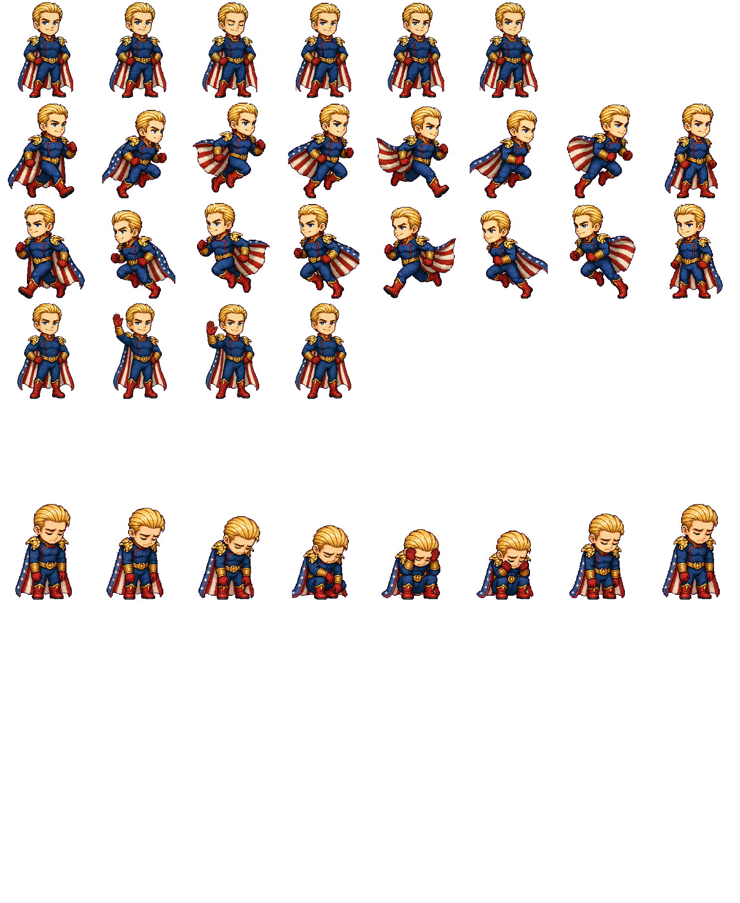
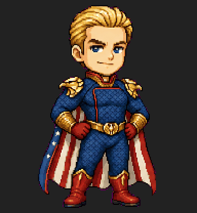
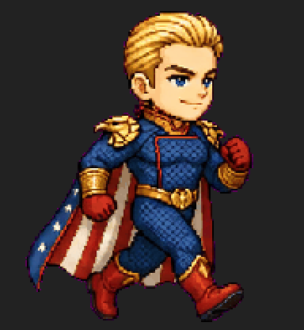
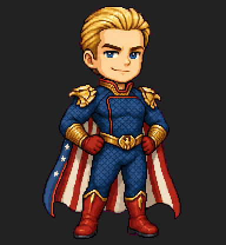
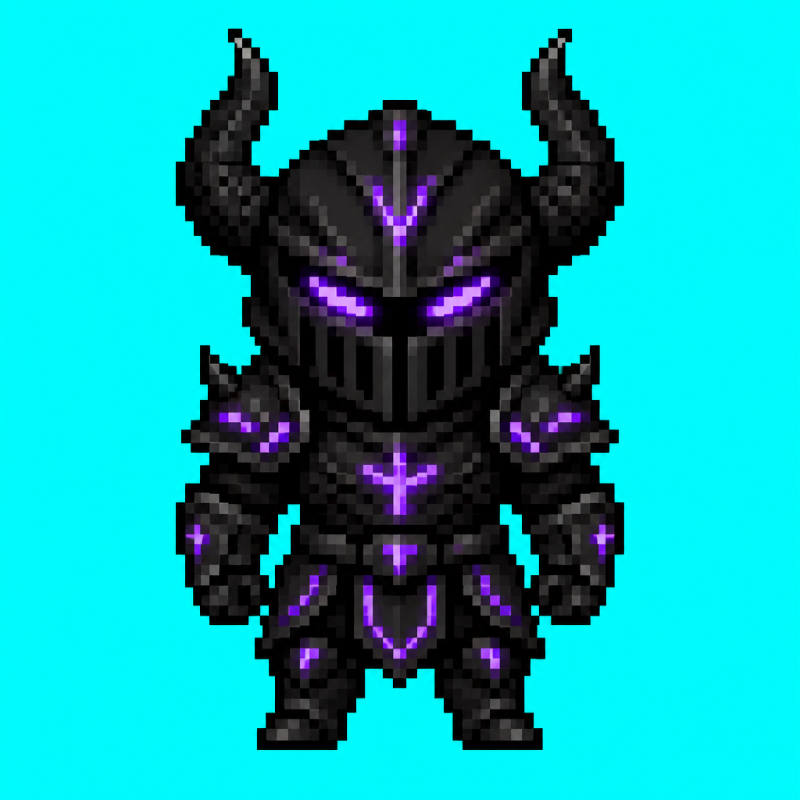
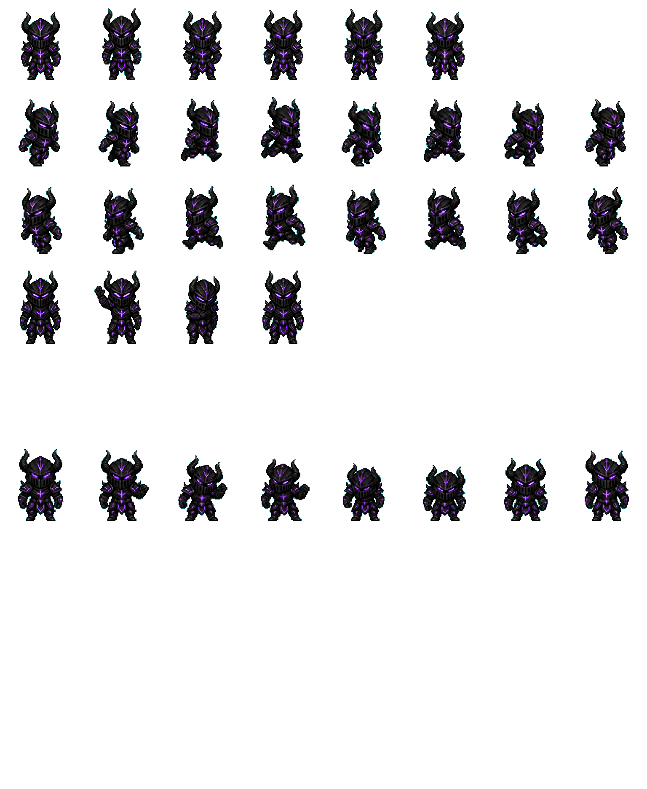
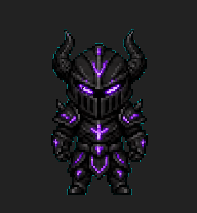
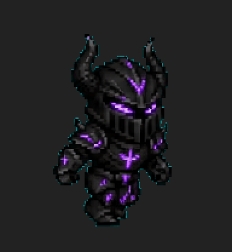
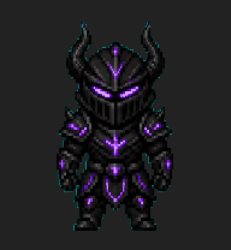
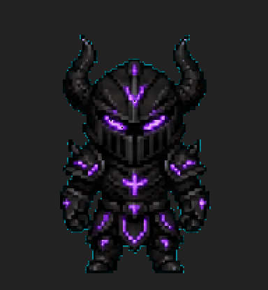

# hatch-pet-claude

[English](README.en.md)

一个用于生成像素风动画宠物精灵图的 Claude Code 技能。输出兼容 Codex 格式的 1536x1872 精灵图集，支持多达 9 种动画状态。

基于 [OpenAI hatch-pet](https://github.com/openai/skills/tree/main/skills/.curated/hatch-pet) 改编，适配 Claude Code，支持任意 OpenAI 兼容的图片生成 API。

> **⚠️ 重要：本技能仅对 GPT-Image-2 适配最好。** GPT-Image-2 是唯一能在一张图中精确绘制多个动画帧的模型。其他模型（Kling、DALL-E 3、Flux、Stable Diffusion 等）无法理解"水平排列 N 个角色帧"的指令，生成效果不可用。


-green)


## 示例

### Homelander — pixel 风格，medium 质量

| 基准形象 | 精灵图集 |
|---------|---------|
|  |  |

| idle | running | waving | failed |
|------|---------|--------|--------|
|  |  |  |  |

### Dark Knight — pixel 风格，low 质量（智能选色：自动从 magenta 切换到 cyan）

| 基准形象 | 精灵图集 |
|---------|---------|
|  |  |

| idle | running | waving | failed |
|------|---------|--------|--------|
|  |  |  |  |

## 工作原理

```
pet.json → prepare.py → generate.py --preview → generate.py → extract.py → spritesheet.webp
 (配置)      (免费)         (~¥0.3)              (~¥3)          (免费)         (完成!)
```

1. **你描述**想要的宠物角色（可选提供参考图）
2. **Claude 引导**你选择风格、质量、动画状态、配置 API
3. **预览**生成 1 张基准图供你确认（medium 质量约 ¥0.3）
4. **批量生成**以基准图为参考生成所有动画帧带
5. **提取组装**去除背景、对齐帧、组装最终精灵图集

## 特性

- **交互式引导** — Claude 全程引导，无需手动编辑文件
- **预览确认** — 先花小钱确认角色形象，满意再批量生成
- **参考图支持** — 可提供截图或草图，AI 基于参考图生成角色
- **9 种动画状态** — 待机、跑步、挥手、跳跃、失败、等待、工作、审查
- **质心对齐** — 自动补偿通用 API 的帧定位偏差
- **镜像派生** — 向左跑自动从向右跑镜像生成（省 1 次 API 调用）
- **Codex 兼容** — 输出可直接用于 [petdex](https://github.com/crafter-station/petdex) 等 Codex 宠物渲染器
- **智能选色** — 自动检测角色颜色与抠图背景的冲突，自动切换到安全的 chroma key 颜色
- **多角色共存** — 每个角色独立目录，无需清理即可创建多个角色
- **任意 API** — 支持 OpenAI 官方或任何 OpenAI 兼容端点（需支持 GPT-Image-2）

## 快速开始

### 作为 Claude Code 技能使用

```bash
# 复制到技能目录
cp -r hatch-pet-claude ~/.claude/skills/hatch-pet

# 然后在 Claude Code 中说：
# "帮我做一个 pet"
```

### 手动使用

```bash
# 1. 安装依赖
pip install Pillow numpy httpx python-dotenv PyJWT

# 2. 配置 API（在你的工作目录下）
cp .env.example .env
# 编辑 .env 填入你的 API key 和 base URL

# 3. 创建角色目录并编辑 pet.json
mkdir my-pet && vi my-pet/pet.json

# 4. 运行流水线（脚本路径指向 skill 目录）
python3 <skill-dir>/scripts/prepare.py ./my-pet
python3 <skill-dir>/scripts/generate.py ./my-pet --preview
python3 <skill-dir>/scripts/generate.py ./my-pet
python3 <skill-dir>/scripts/extract.py ./my-pet
```

## pet.json 配置

```json
{
  "name": "xiao-guo",
  "displayName": "小国",
  "description": "穿红色中式立领夹克的 Q 版像素风中国男孩，圆脸红腮，黑色短发上别着红色五角星发饰。",
  "style": "pixel",
  "quality": "medium",
  "reference_image": null,
  "chroma_key": "auto",
  "states": ["idle", "running-right", "waving", "jumping", "failed", "waiting", "running", "review"],
  "derive_running_left": true
}
```

| 字段 | 说明 |
|------|------|
| `name` | 短横线命名的 ID |
| `displayName` | 显示名称 |
| `description` | 角色的详细视觉描述 — 这是生成的核心依据 |
| `style` | 视觉风格（见下方风格列表） |
| `quality` | `medium`（默认，全套约 ¥3）或 `high`（全套约 ¥13） |
| `reference_image` | 可选的参考图路径（截图、草图等），设为 `null` 表示纯文字生成 |
| `chroma_key` | 抠图用的背景色，`auto` 自动选择（预览后智能检测冲突并切换） |
| `states` | 需要生成的动画状态列表 |
| `derive_running_left` | 设为 `true` 时，向左跑从向右跑镜像生成（省 1 次 API） |

## 风格预设

| 风格 | 适合场景 |
|------|----------|
| `pixel` | 复古像素游戏角色，medium 质量性价比最高 |
| `plush` | 毛绒玩具风格 |
| `clay` | 手工粘土风格 |
| `sticker` | 贴纸风格，粗描边、亮色 |
| `flat-vector` | 扁平矢量风格 |
| `3d-toy` | 3D 玩具风格 |
| `painterly` | 手绘画风 |

## 动画状态

| 状态 | 帧数 | 说明 |
|------|------|------|
| idle | 6 | 待机呼吸循环 — 微微呼吸、眨眼 |
| running-right | 8 | 向右移动 |
| running-left | 8 | 向左移动（自动镜像） |
| waving | 4 | 挥手打招呼 |
| jumping | 5 | 跳跃弧线：蓄力 → 腾空 → 落地 |
| failed | 8 | 失败/沮丧反应 |
| waiting | 6 | 等待用户输入 |
| running | 6 | 工作/处理中（非跑步） |
| review | 6 | 检查完成的输出 |

## 费用

默认使用 `medium` 质量。像素风不需要 `high`。

| 质量 | 预览 | 8 条帧带 | 总计 | 人民币约 |
|------|------|----------|------|---------|
| **medium**（默认） | $0.042 | $0.40 | **$0.44** | **¥3** |
| high | $0.167 | $1.60 | $1.77 | ¥13 |
| low | $0.011 | $0.10 | $0.12 | ¥1 |

以上为 OpenAI 官方直连价格。使用第三方代理可能有加价。

## 输出文件

```
my-pet/
├── pet.json              # 角色配置
├── spritesheet.png       # 完整图集 1536x1872，透明背景
├── spritesheet.webp      # WebP 格式
├── previews/
│   ├── idle.gif          # 各状态的动画预览
│   ├── running-right.gif
│   └── ...
└── .hatch/               # 中间文件（可 gitignore）
```

图集遵循 [Codex 宠物规范](https://github.com/openai/skills/blob/main/skills/.curated/hatch-pet/references/codex-pet-contract.md)：8 列 x 9 行，每帧 192x208 像素。

## 相比 Codex hatch-pet 的改进

| 特性 | Codex hatch-pet | hatch-pet-claude |
|------|----------------|------------------|
| 配置方式 | 编辑 Python 代码 | Claude 交互引导 + pet.json |
| 预览确认 | 无 | 先预览再批量（避免浪费） |
| 参考图 | 无 | 支持截图/草图引导生成 |
| 帧对齐 | 依赖 $imagegen 精度 | 质心对齐（适配通用 API） |
| API 支持 | 仅 Codex 内置 | 任意 OpenAI 兼容端点 |
| 质量控制 | 固定 high | 可选 low/medium/high |

## 常见问题

**帧漂移** — 角色在帧间左右晃动。删除问题帧带后重新运行 `generate.py`（已完成的文件会自动跳过）。质心对齐可自动补偿 15px 以内的漂移。

**紫色残留** — 抠图不干净。在 `extract.py` 中调大 `CHROMA_THRESHOLD`（默认 140.0）。

**角色不一致** — 所有帧带都以基准图为身份参考。如果基准图模糊或太小，请用更详细的描述重新生成预览。

**角色太紧/裁切污染** — AI 有时会把角色排得太密。删掉该帧带重新生成即可（API 有随机性，下次间距通常更好）。medium 质量每条帧带仅约 ¥0.35。

**不要传范例帧带作为参考图** — edits 端点无法区分图片用途，传入其他角色的帧带会污染输出（抄外观、混动作）。只应传入 canonical base 和 layout guide。

## 致谢

- 流水线设计：[OpenAI hatch-pet](https://github.com/openai/skills/tree/main/skills/.curated/hatch-pet)
- 图集格式：[Codex 宠物规范](https://github.com/openai/skills/blob/main/skills/.curated/hatch-pet/references/codex-pet-contract.md)
- 兼容：[petdex](https://github.com/crafter-station/petdex)

## 许可证

MIT
